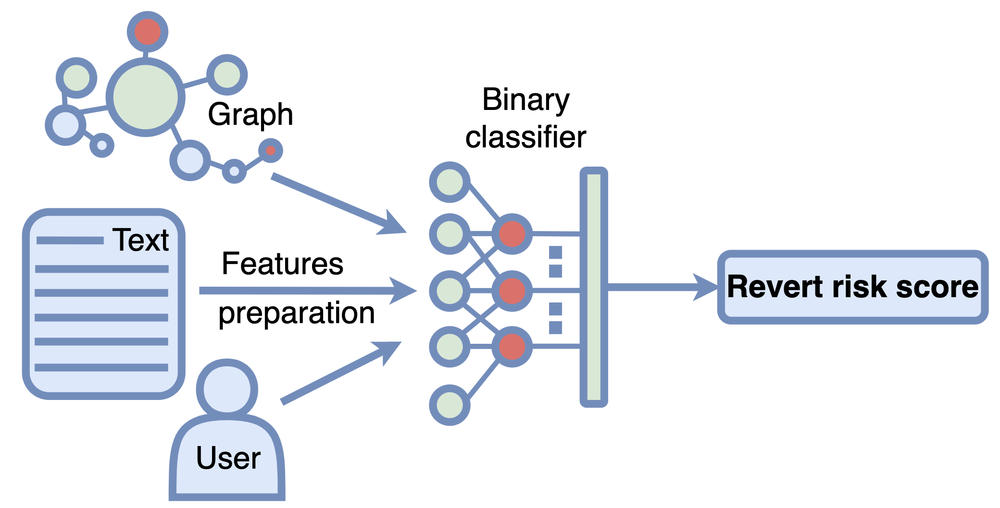

# Graph-Linguistic Fusion: Using Language Models for Wikidata Vandalism Detection



This repository includes resources to reproduce training and evaluation procedure for the paper
**Graph-Linguistic Fusion: Using Language Models for Wikidata Vandalism Detection** (accepted to ACL'25 Industry track) from data collection to model training and evaluation. 

- The full paper already available:
[](https://doi.org/10.18653/v1/2025.acl-industry.21)
- The model inference logic is to be implemented in 
[](https://gitlab.wikimedia.org/repos/research/knowledge_integrity)
- Prepared dataset and artifacts: [](https://doi.org/10.5281/zenodo.15492678)

## Experiments reproducing:

#### 1. Data collection:
`notebooks/01_data_collection.ipynb` includes the data collection process. We use Wikimedia Data Lake to collect the data. In particular we collect revisions metadata, content changes, English labels and ORES scores for comparison.

#### 2. MLM tuning and feature extraction:
`notebooks/02_text_model_training.ipynb` includes the MLM tuning process. We use the [Hugging Face Transformers](https://huggingface.co/docs/transformers/index) library to train the model. GPU is needed for training. We used AMD Radeon Pro WX 9100 16GB GPU. The notebook includes data loading, data splitting logic, along with content processing (extracting content changes, mapping Wikidata IDs to English labels, etc.). In the end the finetuned model is used to calculate the scores for revisions not included in the training set.

#### 3. Final classifier training:
`notebooks/03_classifier_model_training.ipynb` includes the final classifier training process. We use the [CatBoost](https://catboost.ai/en/docs/concepts/python-reference_catboost) library to train the model. The notebook includes data loading, data splitting logic, along with content processing. We train three configurations: only metadata, only text features and both metadata and text features. The final model is saved in the `models` folder.

#### 4. System Validation:
`notebooks/04_validation.ipynb` includes the system validation process. It includes all the metrics and plots presented in the paper. 


## Citation: 
**Graph-Linguistic Fusion: Using Language Models for Wikidata Vandalism Detection**
```
@inproceedings{trokhymovych-etal-2025-graph,
    title = "Graph-Linguistic Fusion: Using Language Models for {W}ikidata Vandalism Detection",
    author = "Trokhymovych, Mykola  and
      Pintscher, Lydia  and
      Baeza-Yates, Ricardo  and
      S{\'a}ez Trumper, Diego",
    editor = "Rehm, Georg  and
      Li, Yunyao",
    booktitle = "Proceedings of the 63rd Annual Meeting of the Association for Computational Linguistics (Volume 6: Industry Track)",
    month = jul,
    year = "2025",
    address = "Vienna, Austria",
    publisher = "Association for Computational Linguistics",
    url = "https://aclanthology.org/2025.acl-industry.21/",
    doi = "10.18653/v1/2025.acl-industry.21",
    pages = "284--294",
    ISBN = "979-8-89176-288-6",
    abstract = "We introduce a next-generation vandalism detection system for Wikidata, one of the largest open-source structured knowledge bases on the Web. Wikidata is highly complex: its items incorporate an ever-expanding universe of factual triples and multilingual texts. While edits can alter both structured and textual content, our approach converts all edits into a single space using a method we call Graph2Text. This allows for evaluating all content changes for potential vandalism using a single multilingual language model. This unified approach improves coverage and simplifies maintenance. Experiments demonstrate that our solution outperforms the current production system. Additionally, we are releasing the code under an open license along with a large dataset of various human-generated knowledge alterations, enabling further research."
}
```
